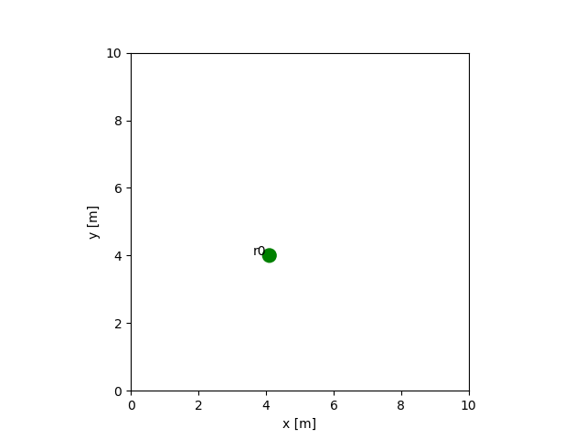
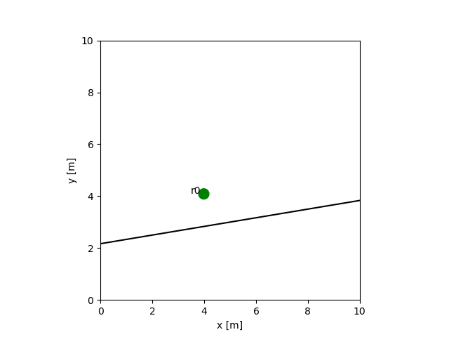
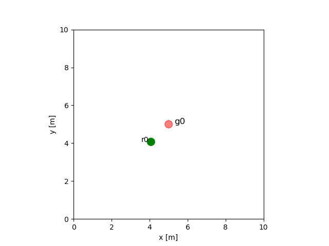

# Homework 2

-- Course: *Intelligent Robot – Professor: Qi Hao*

**Homework Submission Instructions** Please write up your responses to the following problems clearly and concisely. We require you to write up your responses with A4 paper. You are allowed and encouraged to work together. You may discuss the homework to understand the problem and reach a solution in groups. However, each student must write down the solution independently. You must understand the solution well enough in order to reconstruct it by yourself. (This is for your own benefit: you have to take the exams alone.)

**Written Homeworks.** All calculation problems must be written on single-sided A4 paper. The scan version of the paper will also be accepted.

**Coding Homeworks.** Most of coding assignments will be done by Python(>=3.5) under a simple simulator. Your final submission should be a compressed package with extension .zip, which includes your codes and explanations (you need to know how to write the manuscript with Markdown or LATEX). Your code should be run step-by-step without any error. Real-time animation is recommended.

## Question 1

- (a) Imagine you want your robot to perform navigation tasks, which approach would you choose?

- (b) What are the benefits of the behavior based paradigm?

- (c) Which approaches will win in the long run?

## Question 2

- (a) How to generate uniform, perpendicular, attractive, repulse, tangential forces for a robot and obstacles with known positions? Provide related mathematical formulas.

- (c) Please simulate the motions of a robot for given those force fields from the following figure. Provide codes and plots of simulation results as shown below:

<div align=center>  </div>

| Uniform | Perpendicular | Attractive |
| :----:  | :----:        | :----:     | 
|  |  |   |

| Repulsive  | Tangential |
|  :----:   | :----:     |
| <div align=center>  </div> | <div align=center>  </div> |

## Question 3 - Extra Credit

Simulate a robot can reach the goal without sticking into a local trap.
[Coding instruction](#jump)

<div align=center>  </div>

**Requirements:** Provide codes and simulation results with parameter optimization and analysis.

## <span id="jump">Coding instruction</span>

We provide a simple 


### Install the intelligent robot simulator

```
git clone -b edu https://github.com/hanruihua/intelligent-robot-simulator.git
cd intelligent-robot-simulator
pip install -e .
```

### 


